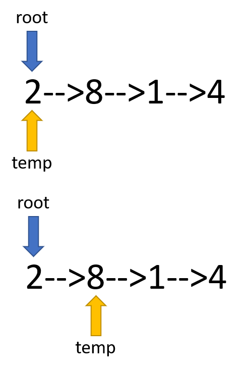

# Add Two Numbers #
You are given two non-empty linked lists representing two non-negative integers. The digits are stored in reverse order and each of their nodes contain a single digit. Add the two numbers and return it as a linked list.

You may assume the two numbers do not contain any leading zero, except the number 0 itself.

**Example**
```
Input: (2 -> 4 -> 3) + (5 -> 6 -> 4)
Output: 7 -> 0 -> 8
Explanation: 342 + 465 = 807.
```
---
## 本题需要注意的地方 ##
本题难度不大，主要的问题是对指针的理解，创建一个题目所给的List，每一个节点包含两个信息，分别是该节点的value值和一个指向下一个节点的指针next。在实际编写python代码的时候，我们需要赋两个指针去实现目标。因为如果只采用单指针，由于该List只能访问下一个节点，无法访问上一个节点，这导致在算法运行过程中，不断创建List的过程中，指针会不断往后移动，因此return的值只有最后一个。为了使得最终能够return完整结果，我们必须定死一个root指针在开头不动。

更细致的分析请看下图：



通过图片可以看到，我在代码中创建了两个指针，一个是root，一个是temp，temp是可以移动的，但root一直不动。这两个指针可以通过以下代码指向同一个List：
```
root = temp = ListNode
```